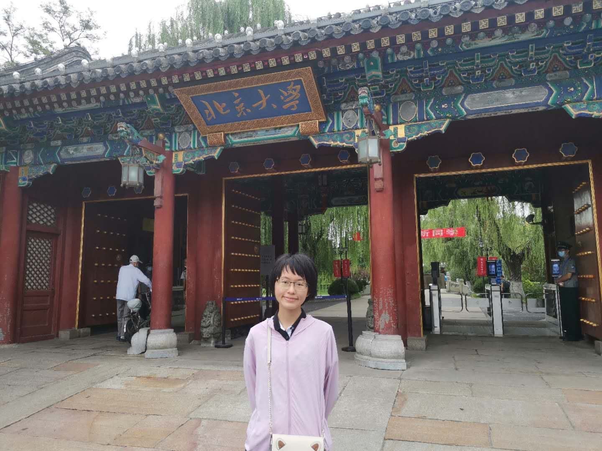

<!DOCTYPE HTML>
<html>
	<head>
		<title>刘诗彬的个人网页</title>
		<meta charset="utf-8" />
		<meta name="viewport" content="width=device-width, initial-scale=1, user-scalable=no" />
		<link rel="stylesheet" href="assets/css/main.css" />
		<noscript><link rel="stylesheet" href="assets/css/noscript.css" /></noscript>
	</head>
	<body class="is-preload">
  
<body>
<h1>我的第一个网页</h1>

hello 大家好呀

我叫刘诗彬，这是我的个人网站

很高兴你来到这里

下面是我的简介

<ul>
  <li> 姓名：刘诗彬</li>
  <li> 性别：女</li>
  <li> 年龄：还有近两个月成年</li>
  <li> 家乡：江西南昌(下图是家乡的标志性建筑 滕王阁）</li>
  
  <li> 高中：江西师大附中</li>
  <li> 点击了解我的高中
  <li> <a href="http://www.jxsdfz.com/ ">我的高中</a> </li>
  <li> 大学：北京大学</li>
  
  <li>点击了解这所位于世一大隔壁的大学
  <li> <a href="https://www.pku.edu.cn/ ">我的大学</a> </li>
  <li> 专业：预防医学</li>
  <li> 性格：内向安静害羞，热爱默默自习，热爱美食</li>
  <li> 愿望：锻炼好身体，学有所成后挽救更多人的生命</li>
  
